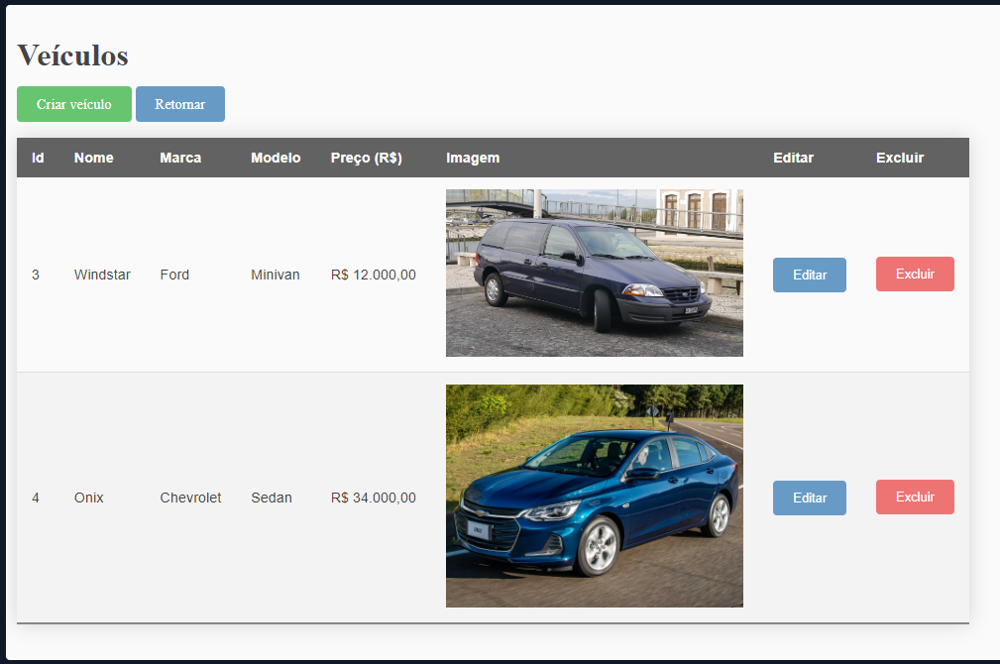
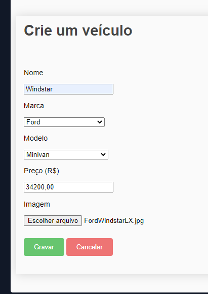
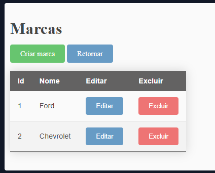
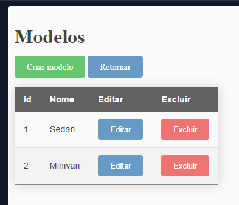

<h1>Laravel CRUD Vehicle project</h1> 

<p align="center">

<a href="https://packagist.org/packages/laravel/framework">


<a href="https://packagist.org/packages/laravel/framework"></a>
</p>

## Project Description 

<p align="justify">
  A Laravel CRUD project using VS Code IDE with XAMPP. 
</p>

## Functions

:heavy_check_mark: CRUD for vehicles

## Screenshots

<h4>Vehicles index screen</h4>

<h4>Vehicles creation screen</h4>

<h4>Brands creation screen</h4>

<h4>Models creation screen</h4>


## Requirements

- [Visual Studio Code](https://code.visualstudio.com/download)
- [PHP](https://www.php.net/)
- [Composer](https://getcomposer.org/download/)
- [MySQL](https://www.mysql.com/)

## How to set and run the project :arrow_forward:

<h4>Project settings</h4>

Run composer for install all dependencies

> composer install

<h4>MySQL settings</h4>

- If you already have a MySQL installed, update the .env and database.php with you settings.

- If you dont have a local MySQL database, install and run XAMPP (for windows users)

  - Include this code in C:\xampp\apache\conf\extrahttpd-vhosts.conf

    ```script
    <VirtualHost *:80>
        DocumentRoot "C:/xampp/htdocs"
        ServerName localhost
    </VirtualHost>
    ```

  - set password root for root user
    > mysqladmin.exe -u root password root

  - Use phpMyAdmin to create a database with a name 'laravel'

<h4>MySQL tables</h4>

- In terminal run php artisan migrate to create tables

> php artisan migrate

<h4>Run laravel</h4>

- Check if ".env" exists in root of project. Is was created a file ".env.example", please rename to ".env".

- Generate a key:

> php artisan key:generate

- Set node libs:

> npm install

> npm run build 

If you runnig this app in Windows, will need set a symlink to show images properly. Run this command:

> php artisan storage:link

If you want to upload big images, you must change this lines in php.ini:

> upload_max_filesize

> post_max_size

- Finally run the application:

> php artisan serve

- access http://127.0.0.1:8000/

- On top-right of the welcome, page create a new user account


## Languages, dependencies and libs used :books:

- [PHP](https://www.php.net/)
- [Composer](https://getcomposer.org/download/)
- [All-in-One PHP support](https://marketplace.visualstudio.com/items?itemName=DEVSENSE.phptools-vscode)
- [XAMPP](https://www.apachefriends.org/pt_br/index.html)

## Issues :exclamation:

I found some Composer errors while trying to build Laravel:

For fix some errors, i uncomment this following lines in php.ini

> extension=fileinfo

> extension=openssl


## Developer :octocat:

| [<br><sub>Rodrigo Luiz Kovalski</sub>](https://github.com/rodrigolk22) |
| :---: |


## License

The Laravel framework is open-sourced software licensed under the [MIT license](https://opensource.org/licenses/MIT).
